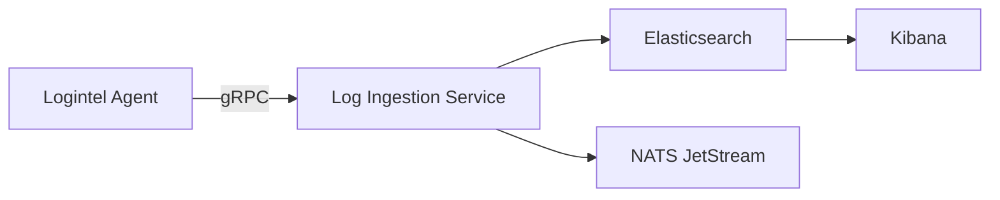

# Logintel Central Server


Logintel is an open-source SIEM and endpoint monitoring platform that collects Linux kernel events in real time using eBPF, fanotify, and D-Bus, stores them efficiently in Elasticsearch.

Logintel Central Server is a SIEM System that is responsible for collecting logs from [Logintel Agent](https://github.com/incodi404/logintel), storing the logs efficiently in Elasticsearch with 3 hours of TTL, connecting with Kibana.

## Why A Central Server?

[Logintel Agent](https://github.com/incodi404/logintel) collects events and that's not enough. The logs should be processed and stored efficiently. If anything goes wrong, instead of roaming file to file to get logs, required logs should be at one place.

## Features

- Ingest logs from different agents
- Store logs in Elasticsearch for 3 hours
- Log visualization in Kibana
- Stream logs to NATS Jetstream

## Services

### Log Ingestion Service

Log ingestion service is responsible for collecting logs from different services via **gRPC**. After collecting logs, it saves the logs in Elasticsearch in different data streams and streams the logs in NATS Jetstream Pub/Sub for fan-out distribution.

### Kibana

Kibana dashboard is connected with Elasticseach and used for log visualization, filtration and exporting as CSV.

## Architecture


## Architecture flow

### Log Ingestion & Processing Flow



## Technologies

### Golang

The entire project, agent and server, are built with Golang. Golang is very lightweight and well-connected to Linux kernel system and has well-maintained packages of eBPF that makes it the best choice for the agent. Also, Golang has very good performance in backend that most of the big companies are now using it in their backend and building cloud native tools with it. After considering all these points, it was crystal clear that Golang is the best choice for the system.

### eBPF

eBPF is a technology that lets developers run custom code within the kernel without writing any kernel module. It also provide enough security to handle bugs in the kernel, so the kernel will not crash. In this project, eBPF is used to capture kernel events that creates a transparency which is the best way to understand what actually happened and how it was happened.

### fanotify

Fanotify is a kernel notification subsystem that notifies user-space applications when any file events occur in the kernel. It keeps an eye on the entire filesystem. It is one of the best choice to track file operarions in a system.

#### Trade-off

It produces massive amount of logs. A good amount of logs have no connection with security events.

#### Implemented Solution

A file path-based blacklist filtration is implemented in the agent. A log with blacklisted path will never reach gRPC. The list is configurable with a YAML file.

### Dbus IPC

Dbus Inter-Process Communication is a system in which user-applications get notified about status of systemd services. Well, this is not connected with any security purpose but we integrated it to get notified whenever anything goes wrong with any systemd service including Logintel Agent.

### Elasticsearch

Elasticsearch is used to store logs and suspicious logs. With low-latency filtration, in-built rollover system, auto-deletion with ILM make the database perfect fit for the system.

### Kibana

Kibana provides stored log visualization with table, graphs and filtration without any extra-coding. One of the best choice for log visualization with in-built integration Elasticsearch REST APIs.

### PostgreSQL

What else should we choose for RDBMS. RBAC structure, command history, agent management all are handled by this database. Chose for scalability and robustness.

### NATS Jetstream

NATS JetStream is the persistence and streaming layer built into NATS, a high-performance messaging system used in distributed applications and microservices. While Core NATS is an in-memory pub/sub system that delivers messages only to active subscribers, JetStream adds durable storage, message replay, acknowledgments, and delivery guarantees.

Integration of Apache Kafka is heavy, latency of RabbitMQ pub/sub is painful. NATS Jetstream provides speed, persistent storage, guarantee and that are the reason it is here.

### RabbitMQ

RabbitMQ handles the background jobs here. For now, it is used to send email on every alert.

### React JS

React JS is for admin panel.

## Future integration

Rule engine and C2 system.

## Kibana Dashboard & Log Visualization

### Unified Log Table


### Single Resource Log


### Single Log Details


### Agent Running in Background


## Roadmap for v1

- ✅ Log ingestion from different agents
- ✅ Storing logs in Elasticsearch
- ✅ Visualizing logs in Kibana

#### The system is still under development and getting better day by day. The first release of the system will be within October, 2026.

## Spin-Up Server with Docker

```shell
git clone https://github.com/incodi404/logintel-server.git
cd logintel-server
docker compose up
```

## Author

Dipankar Chowdhury — Backend Engineer (Security Focused) | [GitHub](https://github.com/incodi404/) · [LinkedIn](https://www.linkedin.com/in/dipankar-chowdhury/)
